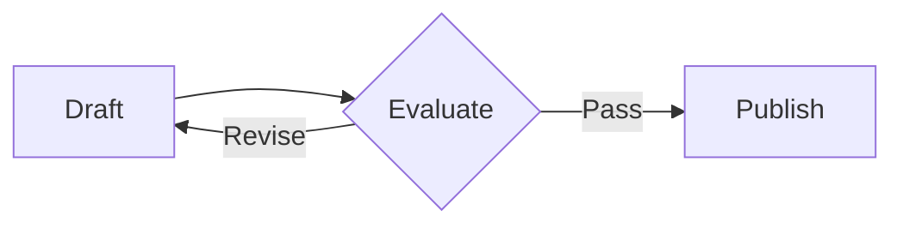

# Huascar Sanchez's website

## Math equations

The site uses Kramdown to process LaTeX math notation and MathJax to render
it in the browser. Enable rendering on a page or post by adding `math: true`
to its existing YAML front matter:

```yaml
---
layout: default
title: An example with equations
math: true
---
```

Use double dollar signs for inline math within a paragraph:

```markdown
Einstein's equation is $$E = mc^2$$.
```

For a display equation, put the delimiters on their own lines, with blank
lines before and after the block:

```markdown
The sample mean satisfies:

$$
\sum_{i=1}^{n} x_i = n\bar{x}
$$
```

Kramdown uses `$$...$$` for both inline and display math, depending on placement.
Use `\vert` instead of a literal `|` inside inline equations to avoid Markdown
table parsing. Code blocks show the notation literally.

MathJax loads from jsDelivr only on pages with `math: true`, so visitors need
network access to that CDN to render equations. Restart a local Jekyll server
after changing `_config.yml`.

References: [Kramdown math syntax](https://kramdown.gettalong.org/syntax.html#math-blocks)
and [MathJax loading](https://docs.mathjax.org/en/stable/web/start.html).

## Mermaid diagrams

Add `mermaid: true` to a page or post's existing front matter (it can be combined
with `math: true`), then write Mermaid source directly in fenced Markdown blocks:

````markdown

````

Diagrams render as SVG in the browser, with responsive sizing and colors that
follow the site's light/dark toggle. Use `accTitle` and `accDescr` to describe
diagrams for assistive technology. Multiple diagrams are supported in one post.

Mermaid loads from jsDelivr only on opted-in pages containing diagram blocks.
If JavaScript is disabled, the CDN is unavailable, or the diagram has invalid
syntax, its source remains visible. No exported image or Jekyll plugin is needed.

Reference: [Mermaid diagram syntax](https://mermaid.js.org/intro/syntax-reference.html).
