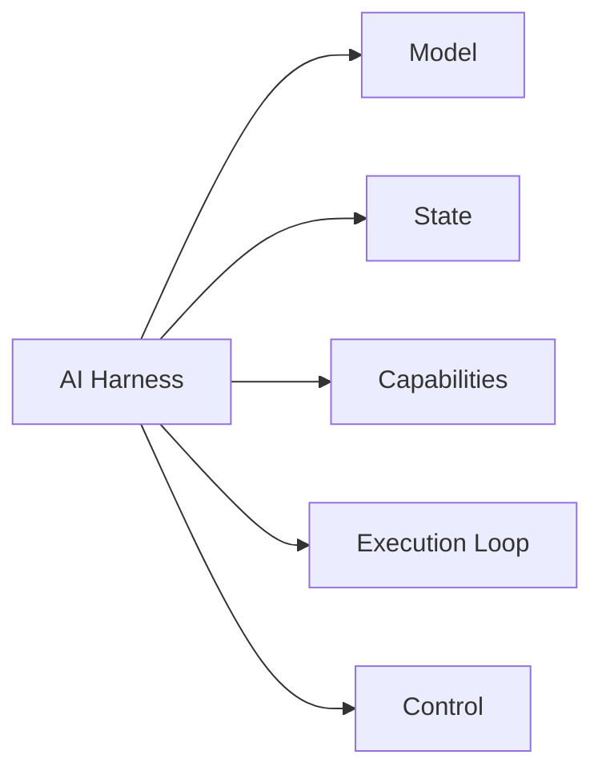
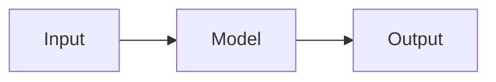
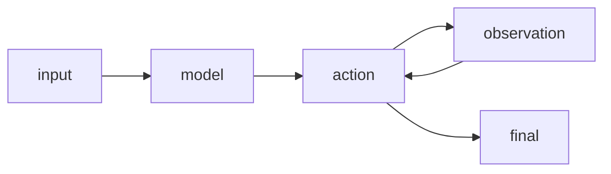
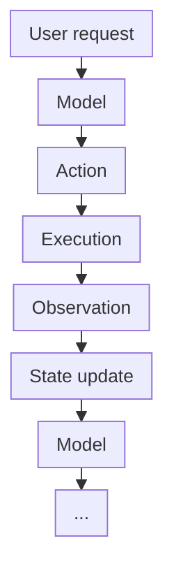
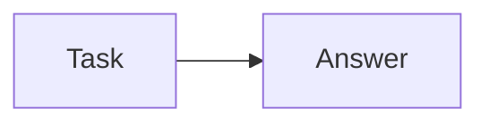
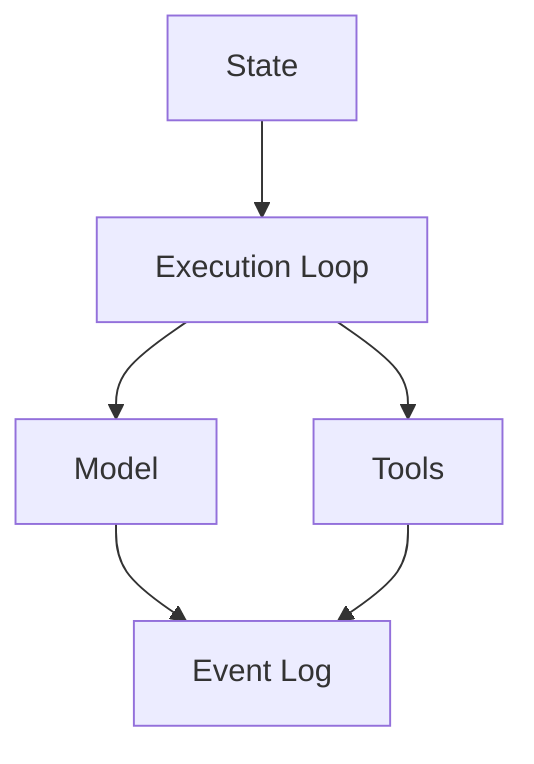
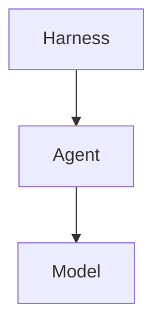
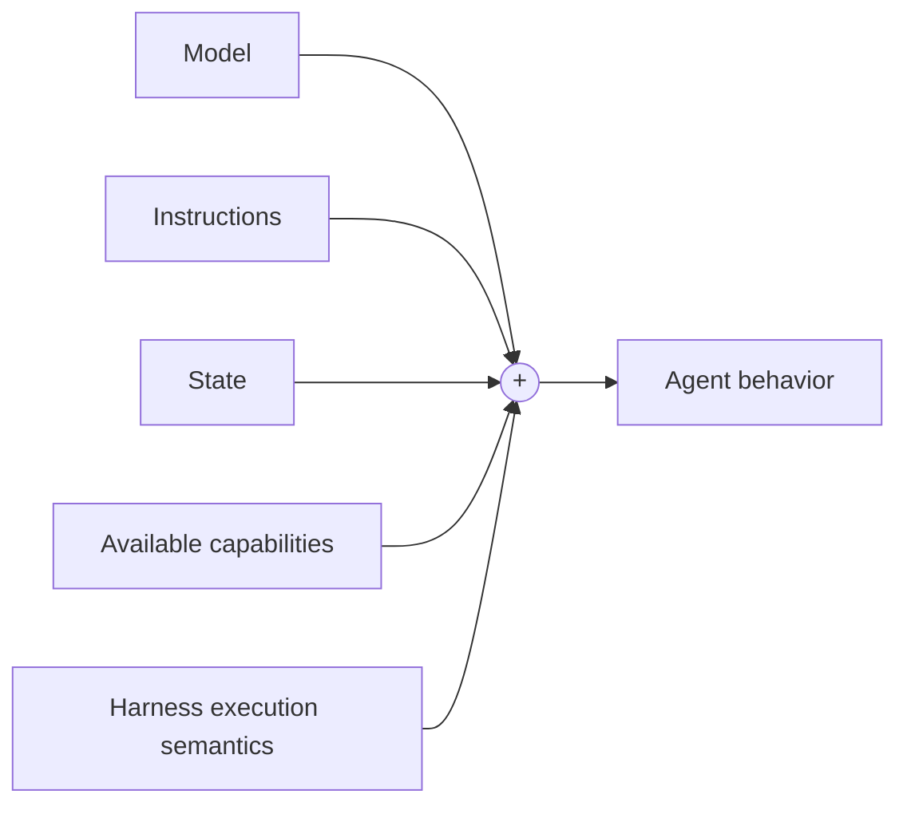
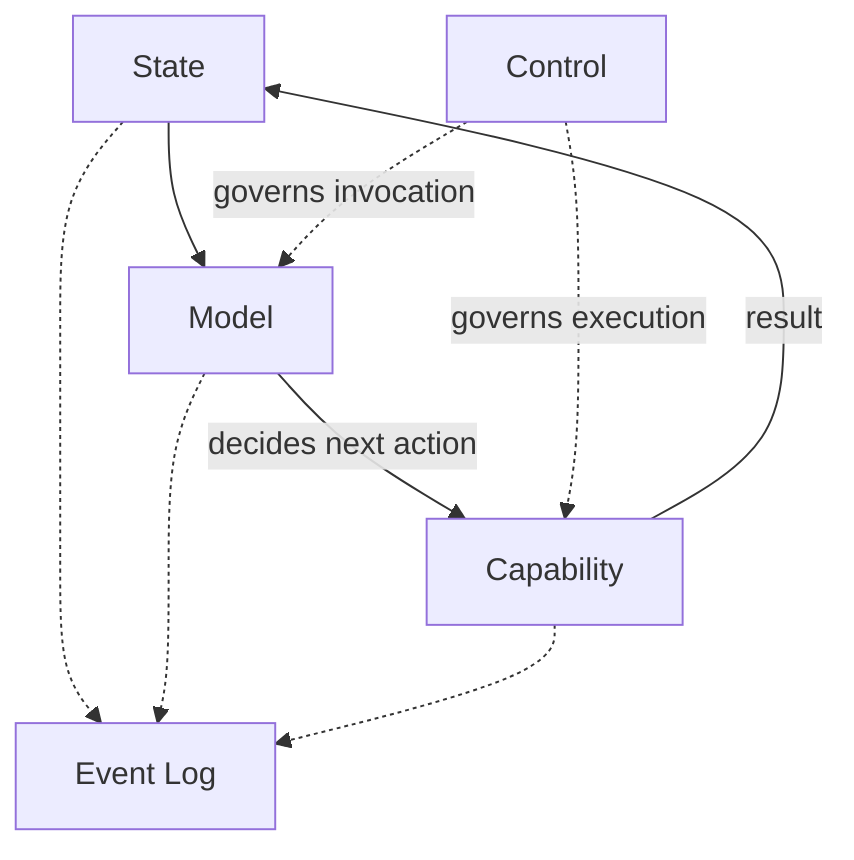

Over the past few months, I have built several AI harnesses to ensure agent
reliability and safety. While the scope of a minimum viable AI harness is still
fresh in my mind, I wanted to write about its anatomy.

In a nutshell, an AI model generates outputs, while an AI harness turns those
outputs into controlled, stateful execution. That distinction matters.

A model can answer a question or generate a tool call, but something else must
maintain context, execute the requested action, return the result, decide
whether another invocation is allowed, and determine when the process is complete.
That something is the AI harness.

At its foundation, the anatomy is surprisingly small:



Or, more compactly:

> AI harness = state + model + capabilities + execution loop + control.

Everything more sophisticated — e.g., memory, planning, retrieval, subagents,
sandboxing, evaluation — can grow from this foundation.

## The Core Anatomy

### Model

The model serves as the decision-making engine inside the harness. Whether it is
a large language model, a multimodal model, or another system that generates
outputs from inputs, the harness interacts with it to determine next steps.

From the harness's perspective, this interface can be remarkably simple:

```python
response = model.generate(
    messages=state,
    tools=available_tools
)
```

Given the current context and available capabilities, the model produces either
a direct response or a request to perform an action. Crucially, however, the
model does not carry out the action itself:

> The model proposes what happens next. The harness makes it executable.

The model is therefore a component of the harness, not the harness itself.

### State

A model invocation only knows what is placed in its context. The harness must
therefore preserve enough information about what has already happened. At
minimum:

```
User:
    Find the problem in this program.

Assistant → Tool:
    read_file("main.py")

Tool:
    <contents of main.py>

Assistant:
    ...
```

Each action produces new information that can influence the next model invocation.
State gives the execution continuity.

More sophisticated systems may introduce working memory, task state,
checkpoints, artifacts, or context compression, but these are extensions of the
same basic idea:

> State tells the next model invocation what has happened so far.

### Capabilities

While state provides context and the model decides what happens next, text
generation alone does not allow a model to interact with its environment.

Capabilities provide the mechanisms to take real-world action. They define the
tools, APIs, and interfaces available to the harness to execute the model's
intent. They might include operations such as:

```python
read_file(path)
write_file(path, content)
search(query)
run_command(command)
query_database(sql)
call_api(...)
```

The harness exposes descriptions of these capabilities to the model. When the
model requests one, the harness interprets the request, validates it, executes
the corresponding operation, and returns the result. 

This creates a fundamental boundary: the model decides what it wants to do while
the harness determines how that action actually happens.

That boundary becomes especially important once permissions, security,
sandboxing, or human approval enter the picture.

### Execution Loop

The execution loop is the heart of the harness. A minimal version might look
like this:

```python
while True:
    response = model.generate(state, tools)

    if response.is_final:
        return response.text

    for call in response.tool_calls:
        result = tools.execute(call)
        state.add(call, result)
```

Without the loop, interaction looks roughly like:



With the harness:



The model can act, observe the result, reconsider what to do, and act again.

This seemingly small architectural change is fundamental. A model invocation
becomes an ongoing interaction with an environment.

### Control: Who Governs the Loop?

Left unchecked, a model will happily loop indefinitely or burn through an API
budget. The harness sets the boundaries.

At minimum, execution stops when the model emits a final answer. In practice,
the harness also enforces operational guardrails:

- Step limits (to catch runaway loops)
- Execution timeouts and cost budgets
- Tool permissions and human approval gates
- User cancellation
- Retry policies and error limits

The model proposes what it wants to do, but the harness holds the kill switch.

### Following One Task Through the Harness

Consider a user asking:

> Find the bug in this repository.

The harness receives the request and initializes state. It then invokes the
model with the current state and available capabilities. E.g., the model decides
that it needs to inspect the repository:

```python
Model
  ↓
list_files()
```

The harness executes the tool:

```python
Tool
  ↓
src/
  main.py
  parser.py
tests/
  test_parser.py
```

That observation enters the state. After that, runs again and decides to inspect
a file:

```python
read_file("src/parser.py")
```

The harness executes the request, records the result, and invokes the model again.
Then, the cycle continues:



Eventually, the model determines that it has enough information and produces a
final response.

The harness did not need a predefined debugging workflow. Instead, it provided
something more general:

> A controlled environment in which a model can repeatedly decide what to do
  next based on what has happened previously.

### The First Extension: Observability

While these five components are enough to build a working harness, one
addition becomes valuable almost immediately: an event log.

That is, instead of seeing a run as:



record the execution:

```
Run
 │
 ├── user_message
 ├── model_request
 ├── model_response
 ├── tool_call
 ├── tool_result
 ├── model_request
 ├── model_response
 └── final
```

Now the harness can answer questions such as:

- What did the model see?
- What action did it choose?
- What did the tool return?
- Where did execution fail?
- How many model calls occurred?
- How much did the run cost?

This trace becomes the foundation for debugging, replay, monitoring, evaluation,
and performance analysis. A minimal practical harness therefore looks something
like:




### Everything Else Builds on the Core

Production systems naturally get much more complex, layering on things like
planning, long-term memory, retrieval, sandboxing, human approvals, and
multi-agent orchestration. But while those capabilities matter, none of them are
required to define a harness. Keeping this distinction clear prevents "AI
harness" from becoming synonymous with an entire agent framework: a harness can
be lean, defined purely by the machinery that turns model decisions into
controlled execution.

### Where Does the Agent Live?

This raises a more interesting question: if the model isn't the agent, and the
harness isn't the agent, where does the agent actually live?

It is tempting to imagine:



But agent behavior is better understood as emerging from the interaction of
several components:



This distinction has practical consequences. Change the model, the instructions,
or the available tools, and behavior will naturally shift. But change the
harness, and behavior changes just as fundamentally.

A harness that permits unlimited actions creates a very different effective
agent from one that requires approval for consequential operations. A harness
that retains the complete interaction history produces different behavior from
one that aggressively compresses context. And a harness that retries failed
actions behaves quite differently from one that immediately terminates.

The harness is not merely plumbing around an otherwise complete agent—its
execution semantics directly shape how the resulting agent behaves.

### The Anatomy in One Picture

Strip away planners, memory systems, retrieval pipelines, subagents, and
orchestration, and the architecture becomes remarkably compact:



The model makes the decisions, state preserves continuity, and capabilities let
it interact with the outside world. The execution loop turns those discrete
steps into an ongoing run, control keeps the process within bounds, and
observability lets you see what actually took place.

That is the basic anatomy:

> An AI harness is the machinery that turns model inference into controlled, stateful execution.

And that's it. Everything else is an extension of this foundation.
